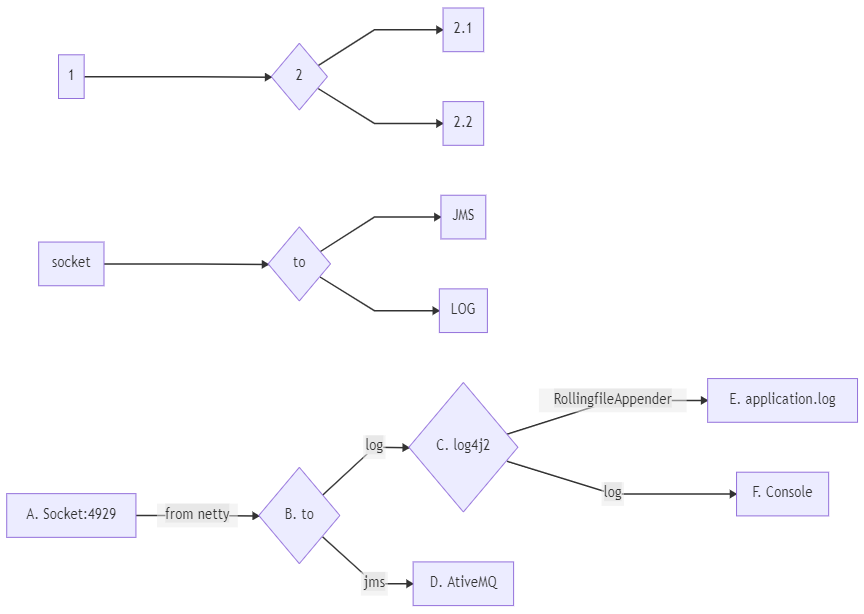

## camel-netty-socket-jms

This application has one route. Socket to JMS


## Common-Errors

org.apache.camel.ResolveEndpointFailedException: Failed to resolve endpoint: mina://tcp://localhost:4209?sync=false due to: No component found with scheme: mina

## Mermaid Diagrams

### Flow Diagram
[Online Editor Link used to genrate below diagram with mermaid](https://mermaid-js.github.io/mermaid-live-editor)
```
graph LR
  1[1] --> 2{2}
  2 --> 2.1[2.1]
  2 --> 2.2[2.2]

  K[socket] --> M{to}
  M --> N1[JMS]
  M --> N2[LOG]

  A[A. Socket:4929] -->|from netty| B{B. to}
  B -->|log| C{C. log4j2}
  B -->|jms| D[D. AtiveMQ]
  C -->|RollingfileAppender| E[E. application.log]
  C -->|log|F[F. Console]
```
